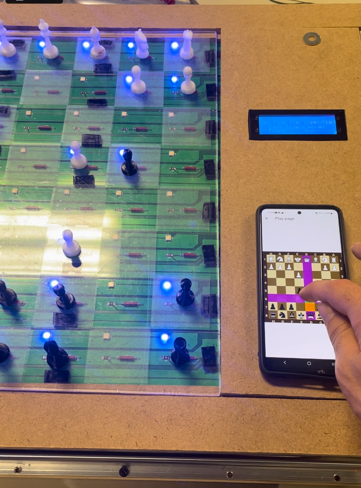

# Chess Game Flutter App with Stockfish AI

## Project Overview

This Flutter app offers a comprehensive chess game experience, allowing users to control motors, LED boards, and start a game with multiple modes. The app integrates the Stockfish engine to generate AI moves, offering multiple difficulty levels to challenge players. It's designed to be used with a physical automatic chessboard or as a standalone game for both beginner and advanced players. It uses bluetooth to communicate with the physical ChessBoard

## Features

- **Direct Control of Motors & LED Board**: The app provides direct control to move chess pieces on the board using step motors and electromagnets, and interacts with a Neopixel LED board to visualize game elements.
- **Game Interface**: A user-friendly interface to start a game, choose game modes, and interact with the board.
- **Multiple Game Modes**:
  - Player vs. Player
  - Player vs. AI (with adjustable difficulty levels)
  - AI vs. AI
- **Stockfish AI**: The app integrates the Stockfish engine to generate AI moves with multiple levels of difficulty, making it suitable for players of all skill levels.
- **Customizable Difficulty**: The AI can be adjusted from beginner to expert levels based on user preferences.
- **Game Status Display**: The app displays real-time game information such as the current player's turn, time remaining, and check/checkmate status.
